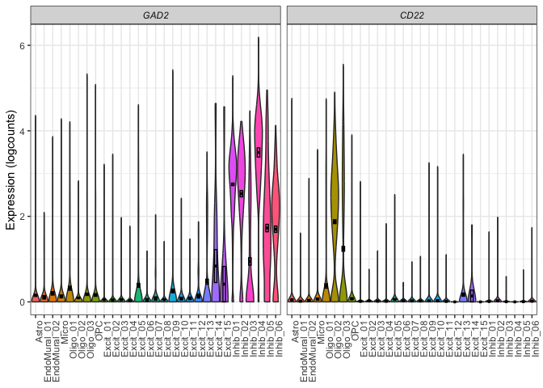

<!-- README.md is generated from README.Rmd. Please edit that file -->

# DeconvoBuddies 

<!-- badges: start -->

[](https://codecov.io/gh/lahuuki/DeconvoBuddies?branch=main)
[](https://github.com/lahuuki/DeconvoBuddies/actions)
<!-- badges: end -->

The goal of `DeconvoBuddies` is to provide helper functions for the
deconvolution process

## Installation instructions

Get the latest stable `R` release from
[CRAN](http://cran.r-project.org/). Then install `DeconvoBuddies` using
from [Bioconductor](http://bioconductor.org/) the following code:

``` r
if (!requireNamespace("BiocManager", quietly = TRUE)) {
    install.packages("BiocManager")
}

BiocManager::install("DeconvoBuddies")
```

And the development version from [GitHub](https://github.com/) with:

``` r
BiocManager::install("LieberInstitute/DeconvoBuddies")
```

## Example

## Access Data

Use `fetch_deconvo_data` Download RNA seqencing data from the Human
DLPFC.

- `rse_gene`: 110 samples of bulk RNA-seq.

- `sce` : snRNA-seq data from the Human DLPFC.

- `sce_DLPFC_example`: Sub-set of `sce` useful for testing.

``` r
if (!exists("sce_DLPFC_example")) sce_DLPFC_example <- fetch_deconvo_data("sce_DLPFC_example")
#> 2024-07-26 17:27:52.71057 loading file /Users/leocollado/Library/Caches/org.R-project.R/R/BiocFileCache/ae44256c3eb9_sce_DLPFC_example.Rdata%3Frlkey%3Dv3z4u8ru0d2y12zgdl1az07q9%26st%3D1dcfqc1i%26dl%3D1
```

## Marker Finding

Find cell type specific markers with `get_mean_ratio` for each gene x
cell type, calculates the Mean Ratio of expression for each gene between
a target cell type and the next highest cell type.

``` r
marker_stats <- get_mean_ratio(sce_DLPFC_example, cellType_col = "cellType_broad_hc")
```

### Extablish Color Scheme

``` r
cell_types <- levels(sce_DLPFC_example$cellType_broad_hc)
cell_colors <- create_cell_colors(cell_types = cell_types, pallet = "classic", split = "\\.", preview = TRUE)
```


### Plot Expression of Specified Genes

Quickly create violin plot of gene expression.

``` r
plot_gene_express(sce = sce_DLPFC_example, cat = "cellType_broad_hc", genes = c("GAD2", "CD22"))
#> No summary function supplied, defaulting to `mean_se()`
#> No summary function supplied, defaulting to `mean_se()`
```


``` r
plot_gene_express(sce = sce_DLPFC_example, cat = "cellType_hc", genes = c("GAD2", "CD22"))
#> No summary function supplied, defaulting to `mean_se()`
#> No summary function supplied, defaulting to `mean_se()`
```



### Plot Expression of Marker Genes

Plot the expression of top marker genes from the statistics calculated
in `get_mean_ratio`.

``` r
plot_marker_express(sce_DLPFC_example,
    marker_stats,
    cellType_col = "cellType_broad_hc",
    cell_type = "Excit",
    gene_col = "gene",
    color_pal = cell_colors
)
#> No summary function supplied, defaulting to `mean_se()`
#> No summary function supplied, defaulting to `mean_se()`
#> No summary function supplied, defaulting to `mean_se()`
#> No summary function supplied, defaulting to `mean_se()`
```


### Create Composition Bar Plot

``` r
# extract phenotype data
pd <- SummarizedExperiment::colData(rse_bulk_test) |>
    as.data.frame()

# Create a long table of estimated proportion data with phenotype details
est_prop_long <- est_prop |>
    tibble::rownames_to_column("RNum") |>
    tidyr::pivot_longer(!RNum, names_to = "cell_type", values_to = "prop") |>
    dplyr::left_join(pd |> dplyr::select(RNum, Dx)) |>
    dplyr::mutate(a = "a")
#> Joining with `by = join_by(RNum)`

## plot composition bar of average proportion
plot_composition_bar(est_prop_long)
```


``` r

## plot composition bar of average proportion by Dx
plot_composition_bar(est_prop_long, x_col = "Dx")
```


``` r

## Set a mininum value for adding text
plot_composition_bar(est_prop_long, x_col = "Dx", min_prop_text = 0.1)
```


## Citation

Below is the citation output from using `citation('DeconvoBuddies')` in
R. Please run this yourself to check for any updates on how to cite
**DeconvoBuddies**.

``` r
print(citation("DeconvoBuddies"), bibtex = TRUE)
#> To cite package 'DeconvoBuddies' in publications use:
#> 
#>   Huuki-Myers LA, Maynard KR, Hicks SC, Zandi P, Kleinman JE, Hyde TM,
#>   Goes FS, Collado-Torres L (2024). _DeconvoBuddies: a R/Bioconductor
#>   package with deconvolution helper functions_.
#>   doi:10.18129/B9.bioc.DeconvoBuddies
#>   <https://doi.org/10.18129/B9.bioc.DeconvoBuddies>,
#>   https://github.com/LieberInstitute/DeconvoBuddies/DeconvoBuddies - R
#>   package version 0.99.0,
#>   <http://www.bioconductor.org/packages/DeconvoBuddies>.
#> 
#> A BibTeX entry for LaTeX users is
#> 
#>   @Manual{,
#>     title = {DeconvoBuddies: a R/Bioconductor package with deconvolution helper functions},
#>     author = {Louise A. Huuki-Myers and Kristen R. Maynard and Stephanie C. Hicks and Peter Zandi and Joel E. Kleinman and Tom M. Hyde and Fernando S. Goes and Leonardo Collado-Torres},
#>     year = {2024},
#>     url = {http://www.bioconductor.org/packages/DeconvoBuddies},
#>     note = {https://github.com/LieberInstitute/DeconvoBuddies/DeconvoBuddies - R package version 0.99.0},
#>     doi = {10.18129/B9.bioc.DeconvoBuddies},
#>   }
#> 
#>   Huuki-Myers LA, Montgomery KD, Kwon SH, Cinquemani S, Eagles NJ,
#>   Gonzalez-Padilla D, Maden SK, Kleinman JE, Hyde TM, Hicks SC, Maynard
#>   KR, Collado-Torres L (2024). "Benchmark of cellular deconvolution
#>   methods using a multi-assay reference dataset from postmortem human
#>   prefrontal cortex." _bioRxiv_. doi:10.1101/2024.02.09.579665
#>   <https://doi.org/10.1101/2024.02.09.579665>,
#>   <https://doi.org/10.1101/2024.02.09.579665>.
#> 
#> A BibTeX entry for LaTeX users is
#> 
#>   @Article{,
#>     title = {Benchmark of cellular deconvolution methods using a multi-assay reference dataset from postmortem human prefrontal cortex},
#>     author = {Louise A. Huuki-Myers and Kelsey D. Montgomery and Sang Ho Kwon and Sophia Cinquemani and Nicholas J. Eagles and Daianna Gonzalez-Padilla and Sean K. Maden and Joel E. Kleinman and Thomas M. Hyde and Stephanie C. Hicks and Kristen R. Maynard and Leonardo Collado-Torres},
#>     year = {2024},
#>     journal = {bioRxiv},
#>     doi = {10.1101/2024.02.09.579665},
#>     url = {https://doi.org/10.1101/2024.02.09.579665},
#>   }
```

Please note that the `DeconvoBuddies` was only made possible thanks to
many other R and bioinformatics software authors, which are cited either
in the vignettes and/or the paper(s) describing this package.

## Code of Conduct

Please note that the `DeconvoBuddies` project is released with a
[Contributor Code of
Conduct](https://contributor-covenant.org/version/2/0/CODE_OF_CONDUCT.html).
By contributing to this project, you agree to abide by its terms.

## Development tools

- Continuous code testing is possible thanks to [GitHub
  actions](https://www.tidyverse.org/blog/2020/04/usethis-1-6-0/)
  through *[usethis](https://CRAN.R-project.org/package=usethis)*,
  *[remotes](https://CRAN.R-project.org/package=remotes)*, and
  *[rcmdcheck](https://CRAN.R-project.org/package=rcmdcheck)* customized
  to use [Bioconductor’s docker
  containers](https://www.bioconductor.org/help/docker/) and
  *[BiocCheck](https://bioconductor.org/packages/3.19/BiocCheck)*.
- Code coverage assessment is possible thanks to
  [codecov](https://codecov.io/gh) and
  *[covr](https://CRAN.R-project.org/package=covr)*.
- The [documentation website](http://.github.io/DeconvoBuddies) is
  automatically updated thanks to
  *[pkgdown](https://CRAN.R-project.org/package=pkgdown)*.
- The code is styled automatically thanks to
  *[styler](https://CRAN.R-project.org/package=styler)*.
- The documentation is formatted thanks to
  *[devtools](https://CRAN.R-project.org/package=devtools)* and
  *[roxygen2](https://CRAN.R-project.org/package=roxygen2)*.

For more details, check the `dev` directory.

This package was developed using
*[biocthis](https://bioconductor.org/packages/3.19/biocthis)*.
