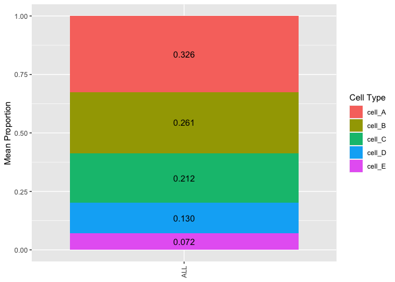
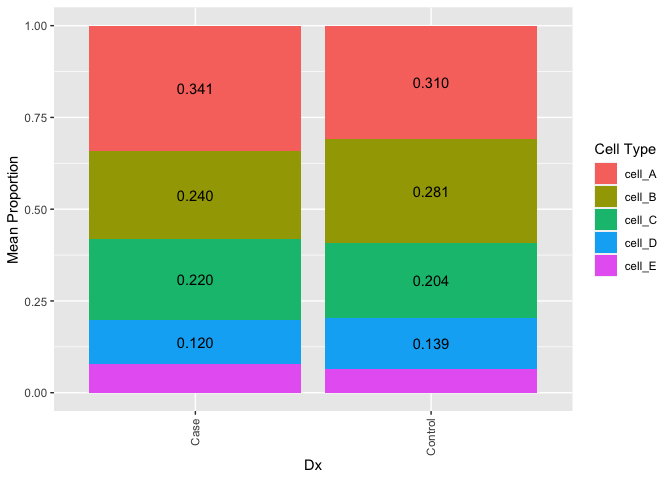

<!-- README.md is generated from README.Rmd. Please edit that file -->

# DeconvoBuddies

<!-- badges: start -->

[](https://codecov.io/gh/lahuuki/DeconvoBuddies?branch=main)
[](https://github.com/lahuuki/DeconvoBuddies/actions)
<!-- badges: end -->

The goal of `DeconvoBuddies` is to provide helper functions for the
deconvolution process

## Installation instructions

Get the latest stable `R` release from
[CRAN](http://cran.r-project.org/). Then install `DeconvoBuddies` using
from [Bioconductor](http://bioconductor.org/) the following code:

``` r
if (!requireNamespace("BiocManager", quietly = TRUE)) {
    install.packages("BiocManager")
}

BiocManager::install("DeconvoBuddies")
```

And the development version from [GitHub](https://github.com/) with:

``` r
BiocManager::install("lahuuki/DeconvoBuddies")
```

## Example

    #> 
    #> Attaching package: 'dplyr'
    #> The following objects are masked from 'package:stats':
    #> 
    #>     filter, lag
    #> The following objects are masked from 'package:base':
    #> 
    #>     intersect, setdiff, setequal, union

Get mean ratios for each gene x cell type

``` r
ratios <- get_mean_ratio2(sce.test)
fc <- findMarkers_1vAll(sce.test)

(marker_stats <- left_join(ratios, fc, by = c("gene", "cellType.target")))
#> # A tibble: 1,778 x 15
#>    gene      cellType.target mean.target cellType  mean ratio rank_ratio Symbol 
#>    <chr>     <fct>                 <dbl> <fct>    <dbl> <dbl>      <int> <chr>  
#>  1 ENSG0000… Inhib.2               1.00  Excit.2  0.239  4.20          1 AL1392…
#>  2 ENSG0000… Inhib.2               1.71  Astro    0.512  3.35          2 SDC3   
#>  3 ENSG0000… Inhib.2               0.950 Astro    0.413  2.30          3 IFI44  
#>  4 ENSG0000… Inhib.2               3.32  Astro    1.47   2.26          4 COL11A1
#>  5 ENSG0000… Inhib.2               3.55  Astro    1.62   2.19          5 NTNG1  
#>  6 ENSG0000… Inhib.2               1.22  Excit.1  0.560  2.18          6 TRIM62 
#>  7 ENSG0000… Inhib.2               3.37  Excit.2  1.96   1.72          7 USP24  
#>  8 ENSG0000… Inhib.2               3.42  Inhib.1  2.44   1.40          8 SPATA6 
#>  9 ENSG0000… Inhib.2               1.21  Astro    0.914  1.33          9 ABCD3  
#> 10 ENSG0000… Inhib.2               1.21  Astro    0.920  1.32         10 GNG12  
#> # … with 1,768 more rows, and 7 more variables: anno_ratio <chr>, logFC <dbl>,
#> #   log.p.value <dbl>, log.FDR <dbl>, std.logFC <dbl>, rank_marker <int>,
#> #   anno_logFC <chr>
```

### Extablish Color Scheme

``` r
cell_types <- levels(sce.test$cellType)
cell_colors <- create_cell_colors(cell_types = cell_types, pallet = "classic", split = "\\.", preview = TRUE)
```


### Plot Expression of Marker Genes

    #> Scale for 'colour' is already present. Adding another scale for 'colour',
    #> which will replace the existing scale.


### Create Composition Bar Plot

``` r
pd <- SummarizedExperiment::colData(rse_bulk_test) %>%
     as.data.frame()

 est_prop_long <- est_prop %>%
     tibble::rownames_to_column("RNum") %>%
     tidyr::pivot_longer(!RNum, names_to = "cell_type", values_to = "prop") %>%
     dplyr::left_join(pd %>% dplyr::select(RNum, Dx)) %>%
     dplyr::mutate(a = "a")
#> Joining, by = "RNum"

 plot_composition_bar(est_prop_long)
```



``` r
 plot_composition_bar(est_prop_long, x_col = "Dx")
```


``` r
 plot_composition_bar(est_prop_long, x_col = "Dx", min_prop_text = 0.1)
```



## Citation

Below is the citation output from using `citation('DeconvoBuddies')` in
R. Please run this yourself to check for any updates on how to cite
**DeconvoBuddies**.

``` r
print(citation('DeconvoBuddies'), bibtex = TRUE)
#> 
#> To cite package 'DeconvoBuddies' in publications use:
#> 
#>   Lousie Huuki (2021). DeconvoBuddies: Helper Functions for LIBD
#>   Deconvolution. R package version 0.99.0.
#>   https://github.com/lahuuki/DeconvoBuddies
#> 
#> A BibTeX entry for LaTeX users is
#> 
#>   @Manual{,
#>     title = {DeconvoBuddies: Helper Functions for LIBD Deconvolution},
#>     author = {Lousie Huuki},
#>     year = {2021},
#>     note = {R package version 0.99.0},
#>     url = {https://github.com/lahuuki/DeconvoBuddies},
#>   }
```

Please note that the `DeconvoBuddies` was only made possible thanks to
many other R and bioinformatics software authors, which are cited either
in the vignettes and/or the paper(s) describing this package.

## Code of Conduct

Please note that the `DeconvoBuddies` project is released with a
[Contributor Code of
Conduct](https://contributor-covenant.org/version/2/0/CODE_OF_CONDUCT.html).
By contributing to this project, you agree to abide by its terms.

## Development tools

-   Continuous code testing is possible thanks to [GitHub
    actions](https://www.tidyverse.org/blog/2020/04/usethis-1-6-0/)
    through *[usethis](https://CRAN.R-project.org/package=usethis)*,
    *[remotes](https://CRAN.R-project.org/package=remotes)*, and
    *[rcmdcheck](https://CRAN.R-project.org/package=rcmdcheck)*
    customized to use [Bioconductor’s docker
    containers](https://www.bioconductor.org/help/docker/) and
    *[BiocCheck](https://bioconductor.org/packages/3.13/BiocCheck)*.
-   Code coverage assessment is possible thanks to
    [codecov](https://codecov.io/gh) and
    *[covr](https://CRAN.R-project.org/package=covr)*.
-   The [documentation website](http://.github.io/DeconvoBuddies) is
    automatically updated thanks to
    *[pkgdown](https://CRAN.R-project.org/package=pkgdown)*.
-   The code is styled automatically thanks to
    *[styler](https://CRAN.R-project.org/package=styler)*.
-   The documentation is formatted thanks to
    *[devtools](https://CRAN.R-project.org/package=devtools)* and
    *[roxygen2](https://CRAN.R-project.org/package=roxygen2)*.

For more details, check the `dev` directory.

This package was developed using
*[biocthis](https://bioconductor.org/packages/3.13/biocthis)*.
