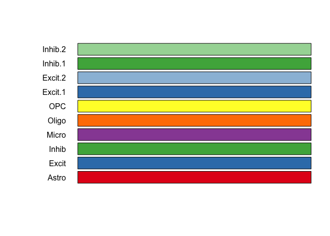
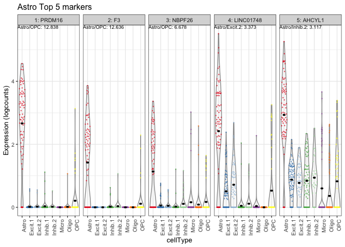

<!-- README.md is generated from README.Rmd. Please edit that file -->

# DeconvoBuddies 

<!-- badges: start -->

[](https://codecov.io/gh/lahuuki/DeconvoBuddies?branch=main)
[](https://github.com/lahuuki/DeconvoBuddies/actions)
<!-- badges: end -->

The goal of `DeconvoBuddies` is to provide helper functions for the
deconvolution process

## Installation instructions

Get the latest stable `R` release from
[CRAN](http://cran.r-project.org/). Then install `DeconvoBuddies` using
from [Bioconductor](http://bioconductor.org/) the following code:

``` r
if (!requireNamespace("BiocManager", quietly = TRUE)) {
    install.packages("BiocManager")
}

BiocManager::install("DeconvoBuddies")
```

And the development version from [GitHub](https://github.com/) with:

``` r
BiocManager::install("LieberInstitute/DeconvoBuddies")
```

## Example

    #> 
    #> Attaching package: 'dplyr'
    #> The following objects are masked from 'package:stats':
    #> 
    #>     filter, lag
    #> The following objects are masked from 'package:base':
    #> 
    #>     intersect, setdiff, setequal, union
    #> Loading required package: SummarizedExperiment
    #> Loading required package: MatrixGenerics
    #> Loading required package: matrixStats
    #> 
    #> Attaching package: 'matrixStats'
    #> The following object is masked from 'package:dplyr':
    #> 
    #>     count
    #> 
    #> Attaching package: 'MatrixGenerics'
    #> The following objects are masked from 'package:matrixStats':
    #> 
    #>     colAlls, colAnyNAs, colAnys, colAvgsPerRowSet, colCollapse,
    #>     colCounts, colCummaxs, colCummins, colCumprods, colCumsums,
    #>     colDiffs, colIQRDiffs, colIQRs, colLogSumExps, colMadDiffs,
    #>     colMads, colMaxs, colMeans2, colMedians, colMins, colOrderStats,
    #>     colProds, colQuantiles, colRanges, colRanks, colSdDiffs, colSds,
    #>     colSums2, colTabulates, colVarDiffs, colVars, colWeightedMads,
    #>     colWeightedMeans, colWeightedMedians, colWeightedSds,
    #>     colWeightedVars, rowAlls, rowAnyNAs, rowAnys, rowAvgsPerColSet,
    #>     rowCollapse, rowCounts, rowCummaxs, rowCummins, rowCumprods,
    #>     rowCumsums, rowDiffs, rowIQRDiffs, rowIQRs, rowLogSumExps,
    #>     rowMadDiffs, rowMads, rowMaxs, rowMeans2, rowMedians, rowMins,
    #>     rowOrderStats, rowProds, rowQuantiles, rowRanges, rowRanks,
    #>     rowSdDiffs, rowSds, rowSums2, rowTabulates, rowVarDiffs, rowVars,
    #>     rowWeightedMads, rowWeightedMeans, rowWeightedMedians,
    #>     rowWeightedSds, rowWeightedVars
    #> Loading required package: GenomicRanges
    #> Loading required package: stats4
    #> Loading required package: BiocGenerics
    #> 
    #> Attaching package: 'BiocGenerics'
    #> The following objects are masked from 'package:dplyr':
    #> 
    #>     combine, intersect, setdiff, union
    #> The following objects are masked from 'package:stats':
    #> 
    #>     IQR, mad, sd, var, xtabs
    #> The following objects are masked from 'package:base':
    #> 
    #>     anyDuplicated, aperm, append, as.data.frame, basename, cbind,
    #>     colnames, dirname, do.call, duplicated, eval, evalq, Filter, Find,
    #>     get, grep, grepl, intersect, is.unsorted, lapply, Map, mapply,
    #>     match, mget, order, paste, pmax, pmax.int, pmin, pmin.int,
    #>     Position, rank, rbind, Reduce, rownames, sapply, setdiff, sort,
    #>     table, tapply, union, unique, unsplit, which.max, which.min
    #> Loading required package: S4Vectors
    #> 
    #> Attaching package: 'S4Vectors'
    #> The following objects are masked from 'package:dplyr':
    #> 
    #>     first, rename
    #> The following object is masked from 'package:utils':
    #> 
    #>     findMatches
    #> The following objects are masked from 'package:base':
    #> 
    #>     expand.grid, I, unname
    #> Loading required package: IRanges
    #> 
    #> Attaching package: 'IRanges'
    #> The following objects are masked from 'package:dplyr':
    #> 
    #>     collapse, desc, slice
    #> Loading required package: GenomeInfoDb
    #> Loading required package: Biobase
    #> Welcome to Bioconductor
    #> 
    #>     Vignettes contain introductory material; view with
    #>     'browseVignettes()'. To cite Bioconductor, see
    #>     'citation("Biobase")', and for packages 'citation("pkgname")'.
    #> 
    #> Attaching package: 'Biobase'
    #> The following object is masked from 'package:MatrixGenerics':
    #> 
    #>     rowMedians
    #> The following objects are masked from 'package:matrixStats':
    #> 
    #>     anyMissing, rowMedians

Get mean ratios for each gene x cell type

``` r
ratios <- get_mean_ratio2(sce.test)
fc <- findMarkers_1vAll(sce.test)
#> Inhib.2 - '2024-04-25 13:04:18.112684
#> Inhib.1 - '2024-04-25 13:04:18.658684
#> OPC - '2024-04-25 13:04:18.863432
#> Astro - '2024-04-25 13:04:19.091077
#> Excit.2 - '2024-04-25 13:04:19.313
#> Oligo - '2024-04-25 13:04:19.496721
#> Micro - '2024-04-25 13:04:19.681585
#> Excit.1 - '2024-04-25 13:04:19.866671
#> Building Table - 2024-04-25 13:04:20.061211
#> ** Done! **

(marker_stats <- left_join(ratios, fc, by = c("gene", "cellType.target")))
#> # A tibble: 1,778 × 15
#>    gene       cellType.target mean.target cellType  mean ratio rank_ratio Symbol
#>    <chr>      <fct>                 <dbl> <fct>    <dbl> <dbl>      <int> <chr> 
#>  1 ENSG00000… Inhib.2               1.00  Excit.2  0.239  4.20          1 AL139…
#>  2 ENSG00000… Inhib.2               1.71  Astro    0.512  3.35          2 SDC3  
#>  3 ENSG00000… Inhib.2               0.950 Astro    0.413  2.30          3 IFI44 
#>  4 ENSG00000… Inhib.2               3.32  Astro    1.47   2.26          4 COL11…
#>  5 ENSG00000… Inhib.2               3.55  Astro    1.62   2.19          5 NTNG1 
#>  6 ENSG00000… Inhib.2               1.22  Excit.1  0.560  2.18          6 TRIM62
#>  7 ENSG00000… Inhib.2               3.37  Excit.2  1.96   1.72          7 USP24 
#>  8 ENSG00000… Inhib.2               3.42  Inhib.1  2.44   1.40          8 SPATA6
#>  9 ENSG00000… Inhib.2               1.21  Astro    0.914  1.33          9 ABCD3 
#> 10 ENSG00000… Inhib.2               1.21  Astro    0.920  1.32         10 GNG12 
#> # ℹ 1,768 more rows
#> # ℹ 7 more variables: anno_ratio <chr>, logFC <dbl>, log.p.value <dbl>,
#> #   log.FDR <dbl>, std.logFC <dbl>, rank_marker <int>, anno_logFC <chr>
```

### Extablish Color Scheme

``` r
cell_types <- levels(sce.test$cellType)
cell_colors <- create_cell_colors(cell_types = cell_types, pallet = "classic", split = "\\.", preview = TRUE)
```



### Plot Expression of Specified Genes

``` r
sce_symbol <- sce.test
rownames(sce_symbol) <- rowData(sce.test)$Symbol
plot_gene_express(sce = sce_symbol, genes = c("RNF220", "CSF3R"))
```


### Plot Expression of Marker Genes

``` r
plot_marker_express(sce.test,
    marker_stats,
    "Astro",
    n_genes = 5,
    rank_col = "rank_ratio",
    anno_col = "anno_ratio",
    color_pal = cell_colors
)
```



### Create Composition Bar Plot

``` r
pd <- SummarizedExperiment::colData(rse_bulk_test) %>%
    as.data.frame()

est_prop_long <- est_prop %>%
    tibble::rownames_to_column("RNum") %>%
    tidyr::pivot_longer(!RNum, names_to = "cell_type", values_to = "prop") %>%
    dplyr::left_join(pd %>% dplyr::select(RNum, Dx)) %>%
    dplyr::mutate(a = "a")
#> Joining with `by = join_by(RNum)`

plot_composition_bar(est_prop_long)
```


``` r
plot_composition_bar(est_prop_long, x_col = "Dx")
```


``` r
plot_composition_bar(est_prop_long, x_col = "Dx", min_prop_text = 0.1)
```


## Citation

Below is the citation output from using `citation('DeconvoBuddies')` in
R. Please run this yourself to check for any updates on how to cite
**DeconvoBuddies**.

``` r
print(citation("DeconvoBuddies"), bibtex = TRUE)
#> To cite package 'DeconvoBuddies' in publications use:
#> 
#>   Huuki-Myers LA, Maynard KR, Hicks SC, Zandi P, Kleinman JE, Hyde TM,
#>   Goes FS, Collado-Torres L (2024). _DeconvoBuddies: a R/Bioconductor
#>   package with deconvolution helper functions_.
#>   doi:10.18129/B9.bioc.DeconvoBuddies
#>   <https://doi.org/10.18129/B9.bioc.DeconvoBuddies>,
#>   https://github.com/LieberInstitute/DeconvoBuddies/DeconvoBuddies - R
#>   package version 0.99.0,
#>   <http://www.bioconductor.org/packages/DeconvoBuddies>.
#> 
#> A BibTeX entry for LaTeX users is
#> 
#>   @Manual{,
#>     title = {DeconvoBuddies: a R/Bioconductor package with deconvolution helper functions},
#>     author = {Louise A. Huuki-Myers and Kristen R. Maynard and Stephanie C. Hicks and Peter Zandi and Joel E. Kleinman and Tom M. Hyde and Fernando S. Goes and Leonardo Collado-Torres},
#>     year = {2024},
#>     url = {http://www.bioconductor.org/packages/DeconvoBuddies},
#>     note = {https://github.com/LieberInstitute/DeconvoBuddies/DeconvoBuddies - R package version 0.99.0},
#>     doi = {10.18129/B9.bioc.DeconvoBuddies},
#>   }
```

Please note that the `DeconvoBuddies` was only made possible thanks to
many other R and bioinformatics software authors, which are cited either
in the vignettes and/or the paper(s) describing this package.

## Code of Conduct

Please note that the `DeconvoBuddies` project is released with a
[Contributor Code of
Conduct](https://contributor-covenant.org/version/2/0/CODE_OF_CONDUCT.html).
By contributing to this project, you agree to abide by its terms.

## Development tools

- Continuous code testing is possible thanks to [GitHub
  actions](https://www.tidyverse.org/blog/2020/04/usethis-1-6-0/)
  through *[usethis](https://CRAN.R-project.org/package=usethis)*,
  *[remotes](https://CRAN.R-project.org/package=remotes)*, and
  *[rcmdcheck](https://CRAN.R-project.org/package=rcmdcheck)* customized
  to use [Bioconductor’s docker
  containers](https://www.bioconductor.org/help/docker/) and
  *[BiocCheck](https://bioconductor.org/packages/3.18/BiocCheck)*.
- Code coverage assessment is possible thanks to
  [codecov](https://codecov.io/gh) and
  *[covr](https://CRAN.R-project.org/package=covr)*.
- The [documentation website](http://.github.io/DeconvoBuddies) is
  automatically updated thanks to
  *[pkgdown](https://CRAN.R-project.org/package=pkgdown)*.
- The code is styled automatically thanks to
  *[styler](https://CRAN.R-project.org/package=styler)*.
- The documentation is formatted thanks to
  *[devtools](https://CRAN.R-project.org/package=devtools)* and
  *[roxygen2](https://CRAN.R-project.org/package=roxygen2)*.

For more details, check the `dev` directory.

This package was developed using
*[biocthis](https://bioconductor.org/packages/3.18/biocthis)*.
