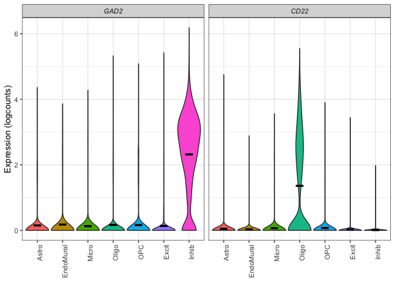

<!-- README.md is generated from README.Rmd. Please edit that file -->

# DeconvoBuddies 

<!-- badges: start -->

[](https://codecov.io/gh/lahuuki/DeconvoBuddies?branch=main)
[](https://github.com/LieberInstitute/DeconvoBuddies/actions/workflows/check-bioc.yml)
[](https://lifecycle.r-lib.org/articles/stages.html#stable)
[](https://bioconductor.org/checkResults/release/bioc-LATEST/DeconvoBuddies)
[](https://bioconductor.org/checkResults/devel/bioc-LATEST/DeconvoBuddies)
[](http://bioconductor.org/packages/stats/bioc/DeconvoBuddies/)
[](https://support.bioconductor.org/tag/DeconvoBuddies)
[](https://bioconductor.org/packages/release/bioc/html/DeconvoBuddies.html#since)
[](http://bioconductor.org/checkResults/devel/bioc-LATEST/DeconvoBuddies/)

<!-- badges: end -->

The goal of `DeconvoBuddies` is to provide helper functions for the
deconvolution process, as well as a paired dataset designed to test the
performance of deconvolution arguments. The dataset is from Human DLPFC,
and contains bulk RNA-seq, single nucleus RNA-seq, and estimated cell
type proportions from RNAScope/IF.

## Installation instructions

Get the latest stable `R` release from
[CRAN](http://cran.r-project.org/). Then install `DeconvoBuddies` using
from [Bioconductor](http://bioconductor.org/) the following code:

``` r
if (!requireNamespace("BiocManager", quietly = TRUE)) {
    install.packages("BiocManager")
}

BiocManager::install("DeconvoBuddies")
```

And the development version from [GitHub](https://github.com/) with:

``` r
BiocManager::install("LieberInstitute/DeconvoBuddies")
```

## Application of DeconvoBuddies

### Access Datasets

DeconvoBuddies contains paired snRNA-seq, bulk RNA-seq, and cell type
proportion data from the human DLPFC.

``` r
## Access data with fetch_deconvo_data
sce_DLPFC_example <- fetch_deconvo_data("sce_DLPFC_example")
#> 2024-08-07 12:33:05.499983 loading file /Users/louise.huuki/Library/Caches/org.R-project.R/R/BiocFileCache/58f79a421ca_sce_DLPFC_example.Rdata%3Frlkey%3Dv3z4u8ru0d2y12zgdl1az07q9%26st%3D1dcfqc1i%26dl%3D1

## explore the single cell experiment object
sce_DLPFC_example
#> class: SingleCellExperiment 
#> dim: 557 10000 
#> metadata(3): Samples cell_type_colors cell_type_colors_broad
#> assays(1): logcounts
#> rownames(557): GABRD PRDM16 ... AFF2 MAMLD1
#> rowData names(7): source type ... gene_type binomial_deviance
#> colnames(10000): 8_AGTGACTGTAGTTACC-1 17_GCAGCCAGTGAGTCAG-1 ...
#>   12_GGACGTCTCTGACAGT-1 1_GGTTAACTCTCTCTAA-1
#> colData names(32): Sample Barcode ... cellType_layer layer_annotation
#> reducedDimNames(0):
#> mainExpName: NULL
#> altExpNames(0):
```

### Find Marker Genes and Visualize Expression

DeconvBuddies has tools for finding marker genes ideal for
deconvolution, and plotting functions to quickly visualize the
expression of selected genes in a snRNA-seq data.

    #> No summary function supplied, defaulting to `mean_se()`
    #> No summary function supplied, defaulting to `mean_se()`



### Plot Deconvoltion Cell Type Proportions

Create composition bar plots of predicted cell type proportions.


## Citation

Below is the citation output from using `citation('DeconvoBuddies')` in
R. Please run this yourself to check for any updates on how to cite
**DeconvoBuddies**.

``` r
print(citation("DeconvoBuddies"), bibtex = TRUE)
#> To cite package 'DeconvoBuddies' in publications use:
#> 
#>   Huuki-Myers LA, Maynard KR, Hicks SC, Zandi P, Kleinman JE, Hyde TM,
#>   Goes FS, Collado-Torres L (2024). _DeconvoBuddies: a R/Bioconductor
#>   package with deconvolution helper functions_.
#>   doi:10.18129/B9.bioc.DeconvoBuddies
#>   <https://doi.org/10.18129/B9.bioc.DeconvoBuddies>,
#>   https://github.com/LieberInstitute/DeconvoBuddies/DeconvoBuddies - R
#>   package version 0.99.0,
#>   <http://www.bioconductor.org/packages/DeconvoBuddies>.
#> 
#> A BibTeX entry for LaTeX users is
#> 
#>   @Manual{,
#>     title = {DeconvoBuddies: a R/Bioconductor package with deconvolution helper functions},
#>     author = {Louise A. Huuki-Myers and Kristen R. Maynard and Stephanie C. Hicks and Peter Zandi and Joel E. Kleinman and Tom M. Hyde and Fernando S. Goes and Leonardo Collado-Torres},
#>     year = {2024},
#>     url = {http://www.bioconductor.org/packages/DeconvoBuddies},
#>     note = {https://github.com/LieberInstitute/DeconvoBuddies/DeconvoBuddies - R package version 0.99.0},
#>     doi = {10.18129/B9.bioc.DeconvoBuddies},
#>   }
#> 
#>   Huuki-Myers LA, Montgomery KD, Kwon SH, Cinquemani S, Eagles NJ,
#>   Gonzalez-Padilla D, Maden SK, Kleinman JE, Hyde TM, Hicks SC, Maynard
#>   KR, Collado-Torres L (2024). "Benchmark of cellular deconvolution
#>   methods using a multi-assay reference dataset from postmortem human
#>   prefrontal cortex." _bioRxiv_. doi:10.1101/2024.02.09.579665
#>   <https://doi.org/10.1101/2024.02.09.579665>,
#>   <https://doi.org/10.1101/2024.02.09.579665>.
#> 
#> A BibTeX entry for LaTeX users is
#> 
#>   @Article{,
#>     title = {Benchmark of cellular deconvolution methods using a multi-assay reference dataset from postmortem human prefrontal cortex},
#>     author = {Louise A. Huuki-Myers and Kelsey D. Montgomery and Sang Ho Kwon and Sophia Cinquemani and Nicholas J. Eagles and Daianna Gonzalez-Padilla and Sean K. Maden and Joel E. Kleinman and Thomas M. Hyde and Stephanie C. Hicks and Kristen R. Maynard and Leonardo Collado-Torres},
#>     year = {2024},
#>     journal = {bioRxiv},
#>     doi = {10.1101/2024.02.09.579665},
#>     url = {https://doi.org/10.1101/2024.02.09.579665},
#>   }
```

Please note that the `DeconvoBuddies` was only made possible thanks to
many other R and bioinformatics software authors, which are cited either
in the vignettes and/or the paper(s) describing this package.

## Code of Conduct

Please note that the DeconvoBuddies project is released with a
[Contributor Code of
Conduct](http://bioconductor.org/about/code-of-conduct/). By
contributing to this project, you agree to abide by its terms.

## Development tools

- Continuous code testing is possible thanks to [GitHub
  actions](https://www.tidyverse.org/blog/2020/04/usethis-1-6-0/)
  through *[usethis](https://CRAN.R-project.org/package=usethis)*,
  *[remotes](https://CRAN.R-project.org/package=remotes)*, and
  *[rcmdcheck](https://CRAN.R-project.org/package=rcmdcheck)* customized
  to use [Bioconductor’s docker
  containers](https://www.bioconductor.org/help/docker/) and
  *[BiocCheck](https://bioconductor.org/packages/3.19/BiocCheck)*.
- Code coverage assessment is possible thanks to
  [codecov](https://codecov.io/gh) and
  *[covr](https://CRAN.R-project.org/package=covr)*.
- The [documentation website](http://.github.io/DeconvoBuddies) is
  automatically updated thanks to
  *[pkgdown](https://CRAN.R-project.org/package=pkgdown)*.
- The code is styled automatically thanks to
  *[styler](https://CRAN.R-project.org/package=styler)*.
- The documentation is formatted thanks to
  *[devtools](https://CRAN.R-project.org/package=devtools)* and
  *[roxygen2](https://CRAN.R-project.org/package=roxygen2)*.

For more details, check the `dev` directory.

This package was developed using
*[biocthis](https://bioconductor.org/packages/3.19/biocthis)*.
